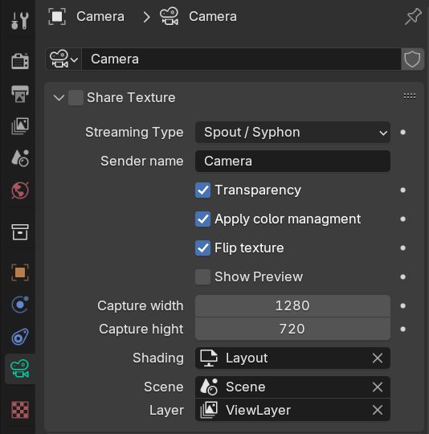

# Texture sharing addon V4.0.0 for Blender 3.0.x

Blender addon that allows to share textures via [Spout](http://spout.zeal.co/) or [Syphon](https://syphon.github.io/)  from blender.

This works for current Windows and OSX.

## Installation

Please make sure you have the most current Blender 3.0.x installed.

1. [Download](https://github.com/maybites/blender.script.spout/releases) the addon from the **releases**

2. Open Blender > Menu >  Preferences > Add-ons > search for and enable the 'TextureSharing' add-on  

3. Press the button to install the SpoutGL or syphon-python library via pip.

4. Once the library is installed, disable and reenable the addon.

5. Play around with the **Viewport Antialiasing Settings** - lower pass numbers can increase the performance.

6. Save and close preferences.

## Usage

Currently it is only possible to send Spout and Syphon streams, but not to receive them.

For sharing you need a **Camera** object.

The plugin adds a panel to the **Camera** properties called 'Share texture'. The following properties are available:

* The sender (also known as syphon-server) name is default set to the camera name.
* use color management (recommended).
* vertical flip of the output texture.
* show preview inside viewport.
* capture/streaming resolution.
* chose a workspace with the desired render / shading preferences.
* chose a scene and layer setup to render.

You should be able to create as many **Cameras** and share textures as you wish.

## Credits

Blender Plugin by Martin Froehlich.

### Special Thanks:

* Lyn Jarvis for developing [Spout](http://spout.zeal.co/)
* Tom Butterworth and Anton Marini for developing [Syphon](https://syphon.github.io/)
* Jason for the python wrappper [SpoutGL for Python](https://github.com/jlai/Python-SpoutGL) 
* Florian Bruggisser for the python wrappper [syphon-python](https://github.com/cansik/syphon-python)
* Without the valuable [hint](https://docs.blender.org/api/master/gpu.html#rendering-the-3d-view-into-a-texture) from Jonas Dichelle I would still dab in darkness...
* [CAD_Sketcher](https://github.com/hlorus/CAD_Sketcher) showed me how to dynamically install the needed libraries. Hurray to Opensource!

### Very Special Thanks

Python support by Florian Bruggisser - without him, the flawless working of spyhon in blender would still be a dream.
